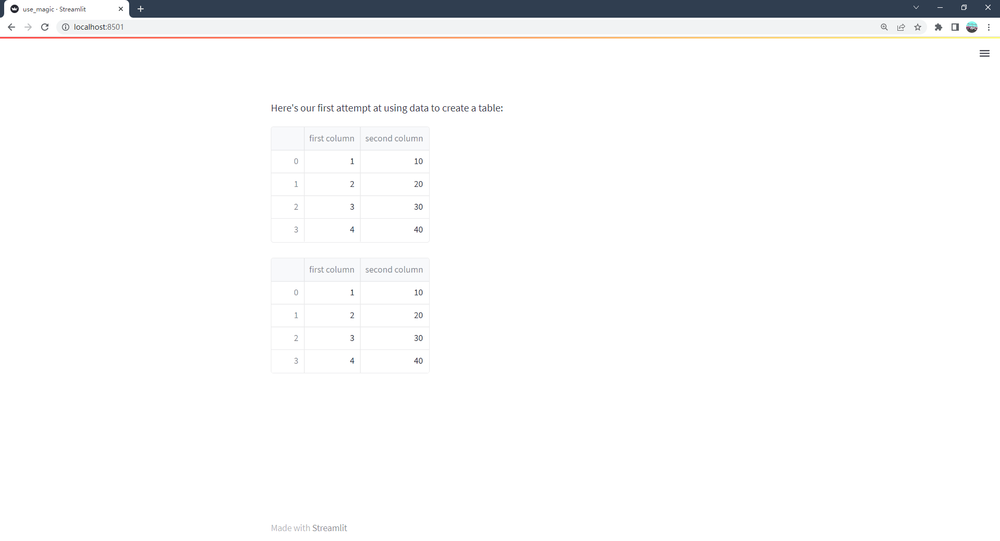
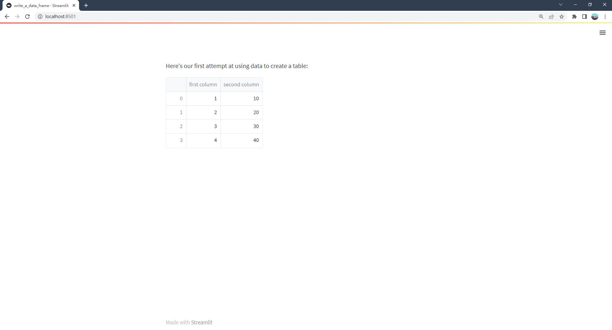
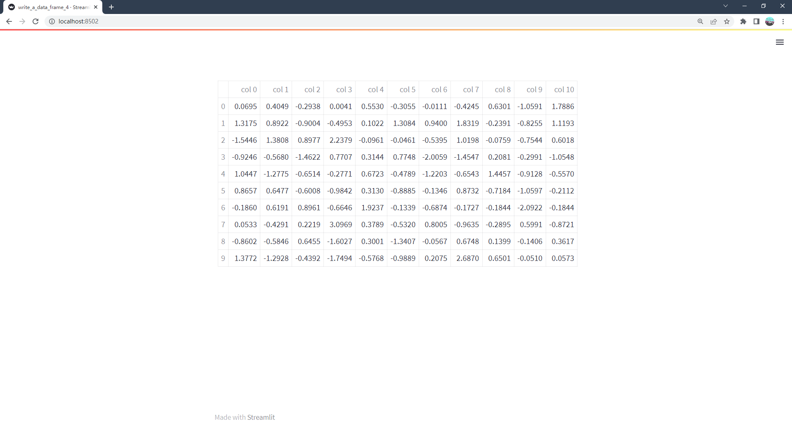
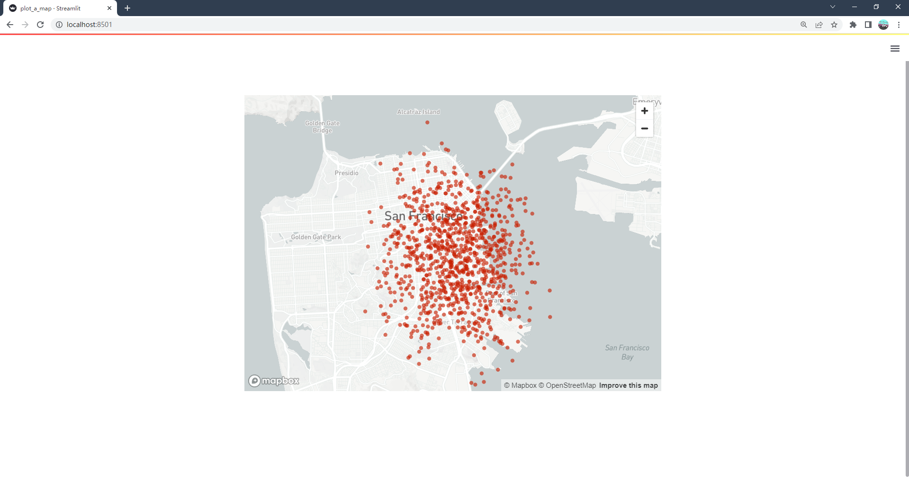
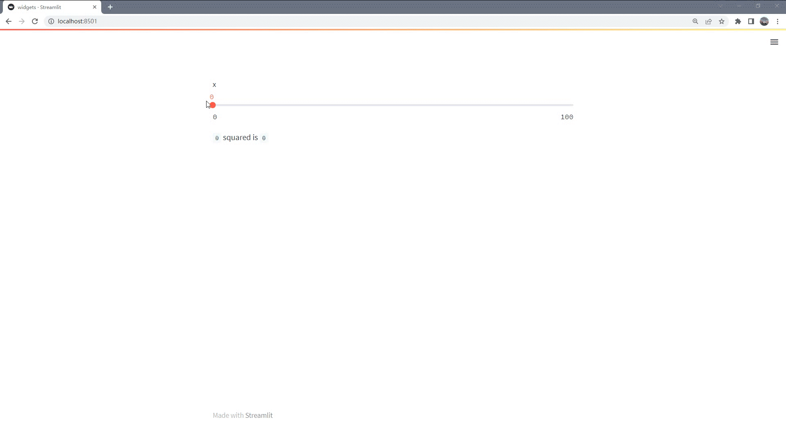
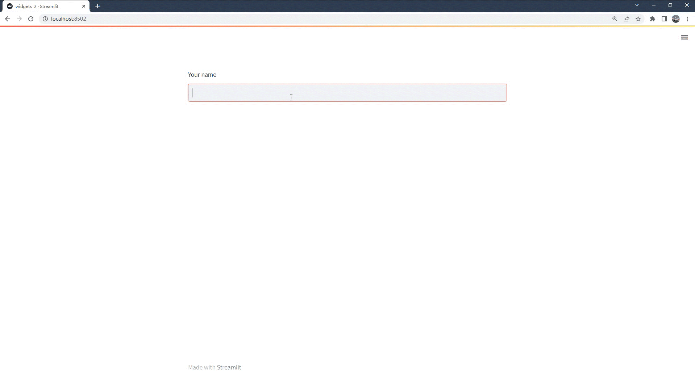
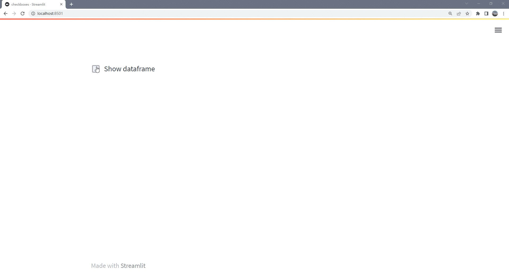
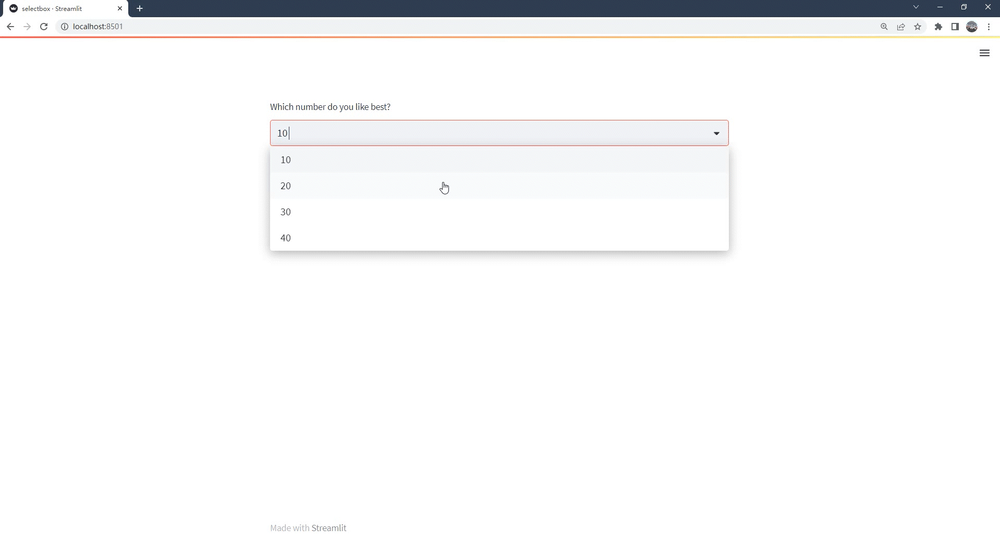
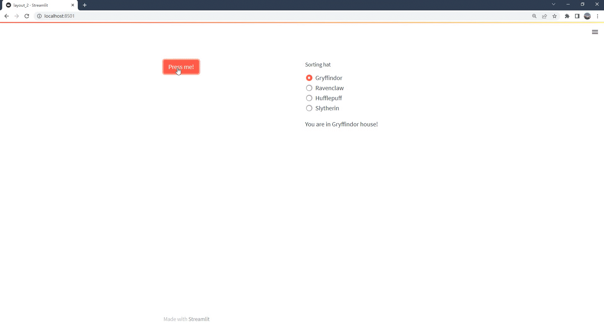
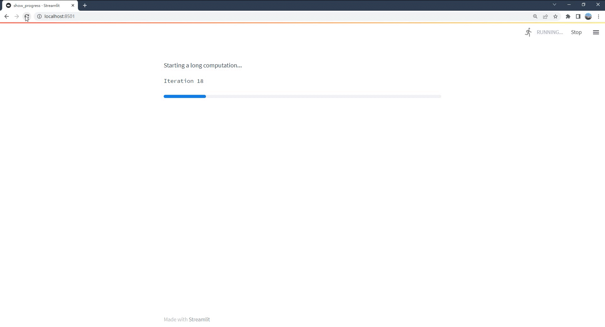

# Main concepts

使用Streamlight很简单。首先，在一个普通的Python脚本中加入一些Streamlit命令，然后使用Streamlit run运行它：

```python
streamlit run your_script.py [-- script args]
```

只要你运行上图所示的脚本，一个本地的Streamlit服务器就会启动，你的应用程序就会在你的默认网络浏览器的一个新标签中打开。该应用程序是你的画布，你将在上面绘制图表、文本、表格及一些其他的小部件等。

在应用程序中绘制什么取决于你。比如[st.text](https://docs.streamlit.io/library/api-reference/text/st.text)将原始文本写入应用程序，[st.line_chart](https://docs.streamlit.io/library/api-reference/charts/st.line_chart)绘制了一幅折线图。请参阅[API文档](https://docs.streamlit.io/library/api-reference)以查看所有可用的命令。

> **注意**
> 在向脚本传递一些自定义参数时，必须在两个减号('--')之后传递。否则，参数将被解释为Streamlit本身的参数。

运行Streamlit的另一种方式是将其作为Python模块运行。当配置了像PyCharm这样的IDE来使用Streamlit时，这种方式可能很有用:

```python
# Running
python -m streamlit run your_script.py

# is equivalent to:
streamlit run your_script.py
```

> **提示**
> 你也可以传递一个URL到 `streamlit run` ! 这个时候结合GitHub gist将会很棒。例如:
>
> ```python
> streamlit run https://raw.githubusercontent.com/streamlit/demo-uber-nyc-pickups/master/streamlit_app.py
> ```
>
> 通过上述的方式，你可以直接启动GitHub仓库中的脚本。

## 开发流程

每次你想要更新你的应用程序，保存源文件。当你这样做时，Streamlit会检测脚本是否有变化，并询问你是否要重新运行应用程序。选择屏幕右上方的“总是重新运行”，每当你更改源代码时，就会自动更新应用程序。

这让您可以在一个快速的交互循环中工作：写入一些代码，保存它，实时测试它，然后写入更多的代码，保存它，测试它，等等，直到您对结果满意为止。这种编码和实时查看结果之间的紧密循环是Streamlit让你开发app更容易的方式之一。

> **提示**
> 在开发Streamlit应用程序时，建议将编辑器和浏览器窗口并排放置，这样代码和应用程序就可以同时看到。试试吧!

从Streamlit 1.10.0及更高版本开始，Streamlit应用程序不能从Linux发行版的根目录运行。如果你试图从根目录运行Streamlit应用程序，Streamlit将抛出`FileNotFoundError: [Errno 2] No such file or directory`的报错。欲了解更多信息，请参阅GitHub issue [#5239](https://github.com/streamlit/streamlit/issues/5239)

如果您使用的是Streamlit 1.10.0或更高版本，那么您的主脚本应该位于根目录以外的目录中。当使用Docker时，你可以使用`WORKDIR`命令指定你的主脚本所在的目录。有关如何做到这一点的示例，请阅读[创建Dockerfile](https://docs.streamlit.io/knowledge-base/tutorials/deploy/docker#create-a-dockerfile)。

## 数据流

Streamlit的架构允许你像编写普通的Python脚本一样编写各种应用程序。为了解决这个问题，Streamlit应用程序有一个独特的数据流：任何时候必须更新屏幕上的某些内容时，**Streamlit从头到尾重新运行你的整个Python脚本**。

这种情况有两种：

* 当你修改你的应用程序的源代码。
* 当用户与应用程序中的小部件交互时。例如，当拖动滑块时，在输入框中输入文本时，或单击按钮时。

无论何时通过`on_change`(或`on_click`)参数将回调传递给小部件，回调总是在脚本的其余部分之前运行。有关回调API的详细信息，请参阅我们的[会话状态API参考指南](https://docs.streamlit.io/library/api-reference/session-state#use-callbacks-to-update-session-state)。

为了使这些快速和无缝衔接，Streamlit在幕后为你做了一些繁重的工作。这个故事中的一个重要角色是[@st.Cache_data](https://docs.streamlit.io/library/get-started/main-concepts#caching)装饰器，它允许开发人员在应用程序重新运行时跳过某些比较费时间的计算。我们将在本页后面介绍缓存，包含了这些内容。

## 呈现和样式数据

在Streamlit应用中有几种方法来显示数据(tables，arrays，dataframes)。接下来将向您介绍*magic*和[st.write()](https://docs.streamlit.io/library/api-reference/write-magic/st.write)，它们可用于写入从文本到表的任何内容。在那之后，让我们看看专门为可视化数据而设计的方法。

### 使用magic

您也可以在不调用任何Streamlit方法的情况下写入应用程序。Streamlit支持**“魔术命令”**，这意味着您根本不必使用[st.write()](https://docs.streamlit.io/library/api-reference/write-magic/st.write)！每当Streamlit在程序代码中的一行中看到变量或文字值时，它都会使用[st.write()](https://docs.streamlit.io/library/api-reference/write-magic/st.write)**自动**将其写入您的应用程序。有关更多信息，请参阅有关[魔术命令](https://docs.streamlit.io/library/api-reference/write-magic/magic)的文档。请尝试运行以下代码片段：

```python
"""
# My first app
"""
import streamlit as st
import pandas as pd
st.write("Here's our first attempt at using data to create a table:")
st.write(pd.DataFrame({
    'first column': [1, 2, 3, 4],
    'second column': [10, 20, 30, 40]
}))
"""
Above is our first attempt at using data to create a table:
"""

df = pd.DataFrame({
  'first column': [1, 2, 3, 4],
  'second column': [10, 20, 30, 40]
})

df
```

*运行结果：*


### 写入数据帧

与[magic commands](https://docs.streamlit.io/library/api-reference/write-magic/magic)一样，[st.write()](https://docs.streamlit.io/library/api-reference/write-magic/st.write)是Streamlit的“瑞士军刀”。你几乎可以将任何东西传递给[st.write()](https://docs.streamlit.io/library/api-reference/write-magic/st.write):文本、数据、Matplotlib图形、Altair图表等等。这么多数据形式，Streamlit怎么区分呢？别担心，Streamlit自己会解决这个问题，并以正确的方式渲染东西。


```python
import streamlit as st
import pandas as pd

st.write("Here's our first attempt at using data to create a table:")
st.write(pd.DataFrame({
    'first column': [1, 2, 3, 4],
    'second column': [10, 20, 30, 40]
}))
```

*运行结果：*


还有其他用于显示特定格式数据的函数，如[st.dataframe()](https://docs.streamlit.io/library/api-reference/data/st.dataframe)和[st.table()](https://docs.streamlit.io/library/api-reference/data/st.table)，也可以用于显示数据。接下来让我们一起了解何时使用这些特性，以及如何向dataframes添加颜色和样式。

您可能会问自己，“为什么我不总是使用```st.write()```呢?”原因如下:

1. *Magic*和[st.write()](https://docs.streamlit.io/library/api-reference/write-magic/st.write)检查你传入的数据类型，然后决定如何在应用程序中最好地渲染它。但是有时你想用另一种方式绘制它。例如，您可能希望使用```st.table(df)```将dataframe绘制为静态表，而不是将其绘制为交互式表格。
2. 第二个原因是，其他方法可以返回一个可以使用和修改的对象，可以向其添加数据，也可以替换它。
3. 最后，如果你使用一个更特定的Streamlit方法，你可以传递额外的参数来定制它的行为。

例如，让我们创建一个dataframe，并使用Pandas ```Styler```对象更改其格式。在本例中，您将使用Numpy生成一个随机样本，并使用[st.dataframe()](https://docs.streamlit.io/library/api-reference/data/st.dataframe)方法绘制一个交互式表。

> **注意**
> 本例使用Numpy生成随机示例，但您可以使用Pandas DataFrames、Numpy数组或普通的Python数组。


```python
import streamlit as st
import numpy as np

dataframe = np.random.randn(10, 20)
st.dataframe(dataframe)
```

*运行结果：* **点击列名可以进行排序等，双击表格元素可以修改数值**


让我们扩展第一个示例，使用Pandas ```Styler```对象突出显示交互表中的一些元素。


```python
import streamlit as st
import numpy as np
import pandas as pd

dataframe = pd.DataFrame(
    np.random.randn(10, 20),
    columns=('col %d' % i for i in range(20)))

st.dataframe(dataframe.style.highlight_max(axis=0))
```

*运行结果：*


Streamlit还有一个用于生成静态表的方法：st.table()。


```python
import streamlit as st
import numpy as np
import pandas as pd

dataframe = pd.DataFrame(
    np.random.randn(10, 20),
    columns=('col %d' % i for i in range(20)))
st.table(dataframe)
```

*运行结果：* **完全静态的表格，不能做任何的修改**




### 绘制图表和地图

Streamlit支持一些流行的数据图表库，如[Matplotlib, Altair, deck.Gl，还有更多](https://docs.streamlit.io/library/api-reference#chart-elements)。在本节中，您将向应用程序添加柱状图、折线图和地图。


### 画一个折线图

使用[st.line_chart()](https://docs.streamlit.io/library/api-reference/charts/st.line_chart)可以很容易地在应用程序中添加折线图。我们将使用Numpy生成一个随机样本，然后绘制图表。

```python
import streamlit as st
import numpy as np
import pandas as pd

chart_data = pd.DataFrame(
     np.random.randn(20, 3),
     columns=['a', 'b', 'c'])

st.line_chart(chart_data)
```

*运行结果：*


### 绘制地图

使用[st.map()](https://docs.streamlit.io/library/api-reference/charts/st.map)可以在地图上显示数据点。让我们使用Numpy生成一些示例数据，并将其绘制在旧金山地图上。


```python
import streamlit as st
import numpy as np
import pandas as pd

map_data = pd.DataFrame(
    np.random.randn(1000, 2) / [50, 50] + [37.76, -122.4],
    columns=['lat', 'lon'])

st.map(map_data)
```

*运行结果：*




## 小部件

当数据或模型进入你想要探索的状态时，你可以添加小部件，比如[st.slider()](https://docs.streamlit.io/library/api-reference/widgets/st.slider)， [st.button()](https://docs.streamlit.io/library/api-reference/widgets/st.button)或[st.selectbox()](https://docs.streamlit.io/library/api-reference/widgets/st.selectbox)。这真的很简单——把小部件当作变量：

```python
import streamlit as st
x = st.slider('x')  # 👈 this is a widget
st.write(x, 'squared is', x * x)
```


在第一次运行时，上面的应用程序应该输出文本“0平方是0”。然后，每当用户与小部件交互时，Streamlit只需从上到下重新运行脚本，将小部件的当前状态分配给进程中的变量。

例如，如果用户将滑块移动到位置`65`,Streamlit将重新运行上面的代码并相应地将`x`设置为`65`。所以现在你应该看到文本“65的平方是4225”。

小部件也可以通过key访问，如果你选择指定一个字符串作为小部件的唯一的key：

```python
import streamlit as st
st.text_input("Your name", key="name")

# You can access the value at any point with:
st.session_state.name
```


每个带有键的小部件都会自动添加到Session State。有关会话状态、它与小部件状态的关联以及它的限制的更多信息，请参阅[会话状态API参考指南](https://docs.streamlit.io/library/api-reference/session-state)。


### 使用复选框显示/隐藏数据

复选框的一个用例是在应用程序中隐藏或显示特定的图表或部分。[st.checkbox()](https://docs.streamlit.io/library/api-reference/widgets/st.checkbox)接受一个参数，即小部件标签。在本例中，复选框用于切换条件语句。

```python
import streamlit as st
import numpy as np
import pandas as pd

if st.checkbox('Show dataframe'):
    chart_data = pd.DataFrame(
       np.random.randn(20, 3),
       columns=['a', 'b', 'c'])

    chart_data
```




### 对选项使用选择框

使用[st.selectbox](https://docs.streamlit.io/library/api-reference/widgets/st.selectbox)从一个系列中进行选择。您可以写入您想要的选项，或者传递一个array或dataframe列。

让我们使用之前创建的`df`数据。

```python
import streamlit as st
import pandas as pd

df = pd.DataFrame({
    'first column': [1, 2, 3, 4],
    'second column': [10, 20, 30, 40]
    })

option = st.selectbox(
    'Which number do you like best?',
     df['first column'])

'You selected: ', option
```




## 布局

Streamlit可以很容易地用[st.sidebar](https://docs.streamlit.io/library/api-reference/layout/st.sidebar)在左侧面板边栏中组织小部件。传递给[st.sidebar](https://docs.streamlit.io/library/api-reference/layout/st.sidebar)的每个元素都固定在左边，允许用户在访问UI控件的同时专注于应用程序中的内容。

例如，如果你想添加一个选择框和一个滑块到侧边栏，使用`st.sidebar.slider`和`st.sidebar.selectbox`而不是`st.slider`和`st.selectbox`：

```python
import streamlit as st

# Add a selectbox to the sidebar:
add_selectbox = st.sidebar.selectbox(
    'How would you like to be contacted?',
    ('Email', 'Home phone', 'Mobile phone')
)

# Add a slider to the sidebar:
add_slider = st.sidebar.slider(
    'Select a range of values',
    0.0, 100.0, (25.0, 75.0)
)
```


除了侧边栏，Streamlit还提供了其他几种方法来控制应用程序的布局。[st.columns](https://docs.streamlit.io/library/api-reference/layout/st.columns)可以让你并排放置小部件，[st.expander](https://docs.streamlit.io/library/api-reference/layout/st.expander)可以通过隐藏大型内容来节省空间。

```python
import streamlit as st

left_column, right_column = st.columns(2)
# You can use a column just like st.sidebar:
left_column.button('Press me!')

# Or even better, call Streamlit functions inside a "with" block:
with right_column:
    chosen = st.radio(
        'Sorting hat',
        ("Gryffindor", "Ravenclaw", "Hufflepuff", "Slytherin"))
    st.write(f"You are in {chosen} house!")
```



> **注意**
> 目前侧栏或布局选项中不支持`St.echo`和`st.spinner`。不过请放心，我们目前也在为这些添加支持!

### 显示进度

当向应用程序中添加长时间运行的计算时，可以使用[st.progress()](https://docs.streamlit.io/library/api-reference/status/st.progress)来实时显示状态。

首先，让我们导入时间。我们将使用`time.sleep()`方法来模拟一个长时间运行的计算：

```python
import time
```

现在，让我们创建一个进度条:

```python
import streamlit as st
import time

'Starting a long computation...'

# Add a placeholder
latest_iteration = st.empty()
bar = st.progress(0)

for i in range(100):
  # Update the progress bar with each iteration.
  latest_iteration.text(f'Iteration {i+1}')
  bar.progress(i + 1)
  time.sleep(0.1)

'...and now we\'re done!'
```



## 主题

Streamlit支持Light和Dark的主题。Streamlit将首先检查用户是否在操作系统和浏览器中设置了亮模式或暗模式。如果是，那么将使用该首选项。否则，默认应用Light主题。

你也可以将活动主题由“☰”→“Settings”。


想要在应用程序中添加自己的主题?“Settings”菜单有一个主题编辑器，点击“Edit active theme”即可访问。您可以使用此编辑器尝试不同的颜色，并实时查看应用程序更新。

当你对你的工作感到满意时，可以通过在`[theme]`配置部分[设置配置选项](https://docs.streamlit.io/library/advanced-features/configuration#set-configuration-options)来保存主题。在你为你的应用程序定义了一个主题后，它将在主题选择器中显示为“自定义主题”，并将在默认情况下应用，而不是包含的Light和Dark主题。

关于定义主题时可用的选项的更多信息，可以在[主题选项文档](https://docs.streamlit.io/library/advanced-features/theming)中找到。

> **注意**
> 主题编辑器菜单仅在本地开发中可用。如果您已经使用Streamlit Community Cloud部署了应用程序，“Edit active theme”按钮将不再显示在“Settings”菜单中。

> **提示**
> 另一种尝试不同主题颜色的方法是打开“Run on save”选项，编辑你的config.toml文件，并观察你的程序使用新的主题颜色重新运行。


## 缓存

Streamlit缓存允许你的应用即使在从web加载数据、操作大型数据集或执行比较费时间的计算时也能保持性能。

缓存背后的基本思想是存储比较费时间的函数调用的结果，并在再次出现相同输入时返回缓存的结果，而不是在后续运行时调用该函数。

要在Streamlit中缓存一个函数，你需要用下面两个装饰器之一(`st.cache_data`和`st.cache_resource`)来装饰它:

```python
@st.cache_data
def long_running_function(param1, param2):
    return …
```

在这个例子中，用`@st.cache_data`装饰`long_running_function`，这告诉Streamlit，无论何时函数被调用，它都会检查两件事:

1. 输入参数的值(在本例中为`param1`和`param2`)。
2. 函数内部的代码。

如果这是Streamlit第一次看到这些参数值和函数代码，它会运行函数并将返回值存储在缓存中。下次使用相同的参数和代码调用函数时(例如，当用户与应用程序交互时)，Streamlit将完全跳过执行函数，而是返回缓存的值。在开发过程中，缓存会随着函数代码的更改而自动更新，确保最新的更改反映在缓存中。

如前所述，有两种缓存装饰器：

* `st.cache_data`是缓存返回数据的计算的推荐方法:从CSV加载DataFrame，转换NumPy数组，查询API，或任何其他返回可序列化数据对象的函数(str, int, float, DataFrame, array, list，…)它在每次函数调用时创建数据的新副本，使其免受突变和竞争条件的影响。在大多数情况下，`st.cache_data`的行为是你想要的——所以如果你不确定，从`st.cache_data`开始，看看它是否有效!
* `st.cache_resource`是缓存全局资源(如ML模型或数据库连接)的推荐方法——您不想多次加载的不可序列化对象。使用它，你可以在应用程序的所有再次运行和会话中共享这些资源，而无需复制或冗余。注意，对缓存返回值的任何变化都会直接改变缓存中的对象(详细信息见下文)。
  
  *Streamlit的两个缓存装饰器及其用例。*

有关Streamlit缓存装饰器、它们的配置参数及其限制的更多信息，请参见[Caching](https://docs.streamlit.io/library/advanced-features/caching)。


## 页面

随着应用程序变得越来越大，将它们组织成多个页面变得非常有用。这使得开发人员更容易管理应用程序，用户也更容易浏览应用程序。Streamlit提供了一种创建多页面应用的无障碍方式。

我们设计了这个功能，这样构建多页应用程序就像构建单页应用程序一样简单!只需向现有应用程序添加更多页面，如下所示：

1. 在包含主脚本的文件夹中，创建一个新的`pages`文件夹。假设主脚本名为`main_page.py`。
2. 在`pages`文件夹中添加新的`.py`文件，向应用程序添加更多页面。
3. 像往常一样运行`streamlit Run main_page.py`。

就是这样!`main_page.py`脚本现在将对应于应用程序的主页面。你会在侧边栏页面选择器中看到`pages`文件夹中的其他脚本。例如：
*main_page.py*

```python
import streamlit as st

st.markdown("# Main page 🎈")
st.sidebar.markdown("# Main page 🎈")
```

*pages/page_2.py*

```python
import streamlit as st

st.markdown("# Page 2 ❄️")
st.sidebar.markdown("# Page 2 ❄️")
```

*pages/page_3.py*

```python
import streamlit as st

st.markdown("# Page 3 🎉")
st.sidebar.markdown("# Page 3 🎉")
```

现在运行`streamlit run main_page.py`，查看你闪亮的新多页应用程序!

我们关于[多页应用程序](https://docs.streamlit.io/library/get-started/multipage-apps)的文档教你如何向应用程序添加页面，包括如何定义页面，结构和运行多页应用程序，以及在页面之间导航。一旦你理解了基础知识，就可以[创建你的第一个多页面应用](https://docs.streamlit.io/library/get-started/multipage-apps/create-a-multipage-app)了!


## 应用程序模型

现在您已经了解了所有单独的部分，让我们关闭循环并回顾它是如何一起工作的:

1. Streamlit应用程序是从上到下运行的Python脚本
2. 每当用户打开指向应用程序的浏览器选项卡时，脚本就会重新执行
3. 当脚本执行时，Streamlit在浏览器中实时绘制输出
4. 脚本使用Streamlit缓存来避免重新计算费时的函数，因此更新发生得非常快
5. 每当用户与小部件交互时，您的脚本将被重新执行，并且在运行期间该小部件的输出值将被设置为新值。
6. Streamlit应用程序可以包含多个页面，这些页面在`pages`文件夹中的独立`.py`文件中定义。
   
