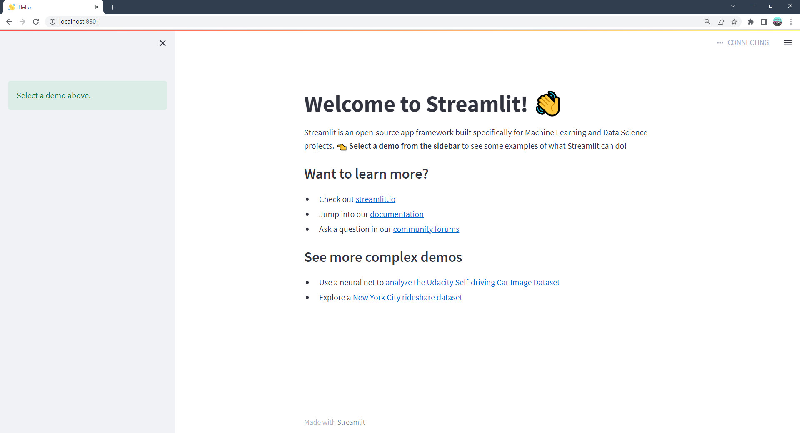

# Create a multipage app

在上一节中，我们学习了如何创建多页应用程序，包括如何定义页面、构造和运行多页应用程序，以及如何在用户界面中在页面之间导航。如果你需要复习，现在可以看一看。

在本指南中，让我们把对多页应用程序的理解付诸实践，把我们熟悉的 `streamlit hello` 命令转换成多页应用程序。

## **动机**

在Streamlit 1.10.0之前，Streamlit hello命令是一个大的单页应用程序。由于不支持多页，我们使用 `st.selectbox` 来分割应用程序的内容。在侧边栏中选择要运行的内容。内容包括三个演示，分别是绘图、映射和数据框架。

下面是代码和单页应用程序的样子：

### **hello.py**

```
import streamlit as st

def intro():
    import streamlit as st

    st.write("# Welcome to Streamlit! 👋")
    st.sidebar.success("Select a demo above.")

    st.markdown(
        """
        Streamlit is an open-source app framework built specifically for
        Machine Learning and Data Science projects.

        **👈 Select a demo from the dropdown on the left** to see some examples
        of what Streamlit can do!

        ### Want to learn more?

        - Check out [streamlit.io](https://streamlit.io)
        - Jump into our [documentation](https://docs.streamlit.io)
        - Ask a question in our [community
          forums](https://discuss.streamlit.io)

        ### See more complex demos

        - Use a neural net to [analyze the Udacity Self-driving Car Image
          Dataset](https://github.com/streamlit/demo-self-driving)
        - Explore a [New York City rideshare dataset](https://github.com/streamlit/demo-uber-nyc-pickups)
    """
    )

def mapping_demo():
    import streamlit as st
    import pandas as pd
    import pydeck as pdk

    from urllib.error import URLError

    st.markdown(f"# {list(page_names_to_funcs.keys())[2]}")
    st.write(
        """
        This demo shows how to use
[`st.pydeck_chart`](https://docs.streamlit.io/library/api-reference/charts/st.pydeck_chart)
to display geospatial data.
"""
    )

    @st.cache_data
    def from_data_file(filename):
        url = (
            "http://raw.githubusercontent.com/streamlit/"
            "example-data/master/hello/v1/%s" % filename
        )
        return pd.read_json(url)

    try:
        ALL_LAYERS = {
            "Bike Rentals": pdk.Layer(
                "HexagonLayer",
                data=from_data_file("bike_rental_stats.json"),
                get_position=["lon", "lat"],
                radius=200,
                elevation_scale=4,
                elevation_range=[0, 1000],
                extruded=True,
            ),
            "Bart Stop Exits": pdk.Layer(
                "ScatterplotLayer",
                data=from_data_file("bart_stop_stats.json"),
                get_position=["lon", "lat"],
                get_color=[200, 30, 0, 160],
                get_radius="[exits]",
                radius_scale=0.05,
            ),
            "Bart Stop Names": pdk.Layer(
                "TextLayer",
                data=from_data_file("bart_stop_stats.json"),
                get_position=["lon", "lat"],
                get_text="name",
                get_color=[0, 0, 0, 200],
                get_size=15,
                get_alignment_baseline="'bottom'",
            ),
            "Outbound Flow": pdk.Layer(
                "ArcLayer",
                data=from_data_file("bart_path_stats.json"),
                get_source_position=["lon", "lat"],
                get_target_position=["lon2", "lat2"],
                get_source_color=[200, 30, 0, 160],
                get_target_color=[200, 30, 0, 160],
                auto_highlight=True,
                width_scale=0.0001,
                get_width="outbound",
                width_min_pixels=3,
                width_max_pixels=30,
            ),
        }
        st.sidebar.markdown("### Map Layers")
        selected_layers = [
            layer
            for layer_name, layer in ALL_LAYERS.items()
            if st.sidebar.checkbox(layer_name, True)
        ]
        if selected_layers:
            st.pydeck_chart(
                pdk.Deck(
                    map_style="mapbox://styles/mapbox/light-v9",
                    initial_view_state={
                        "latitude": 37.76,
                        "longitude": -122.4,
                        "zoom": 11,
                        "pitch": 50,
                    },
                    layers=selected_layers,
                )
            )
        else:
            st.error("Please choose at least one layer above.")
    except URLError as e:
        st.error(
            """
            **This demo requires internet access.**

            Connection error: %s
        """
            % e.reason
        )

def plotting_demo():
    import streamlit as st
    import time
    import numpy as np

    st.markdown(f'# {list(page_names_to_funcs.keys())[1]}')
    st.write(
        """
        This demo illustrates a combination of plotting and animation with
Streamlit. We're generating a bunch of random numbers in a loop for around
5 seconds. Enjoy!
"""
    )

    progress_bar = st.sidebar.progress(0)
    status_text = st.sidebar.empty()
    last_rows = np.random.randn(1, 1)
    chart = st.line_chart(last_rows)

    for i in range(1, 101):
        new_rows = last_rows[-1, :] + np.random.randn(5, 1).cumsum(axis=0)
        status_text.text("%i%% Complete" % i)
        chart.add_rows(new_rows)
        progress_bar.progress(i)
        last_rows = new_rows
        time.sleep(0.05)

    progress_bar.empty()

    # Streamlit widgets automatically run the script from top to bottom. Since
    # this button is not connected to any other logic, it just causes a plain
    # rerun.
    st.button("Re-run")


def data_frame_demo():
    import streamlit as st
    import pandas as pd
    import altair as alt

    from urllib.error import URLError

    st.markdown(f"# {list(page_names_to_funcs.keys())[3]}")
    st.write(
        """
        This demo shows how to use `st.write` to visualize Pandas DataFrames.

(Data courtesy of the [UN Data Explorer](http://data.un.org/Explorer.aspx).)
"""
    )

    @st.cache_data
    def get_UN_data():
        AWS_BUCKET_URL = "http://streamlit-demo-data.s3-us-west-2.amazonaws.com"
        df = pd.read_csv(AWS_BUCKET_URL + "/agri.csv.gz")
        return df.set_index("Region")

    try:
        df = get_UN_data()
        countries = st.multiselect(
            "Choose countries", list(df.index), ["China", "United States of America"]
        )
        if not countries:
            st.error("Please select at least one country.")
        else:
            data = df.loc[countries]
            data /= 1000000.0
            st.write("### Gross Agricultural Production ($B)", data.sort_index())

            data = data.T.reset_index()
            data = pd.melt(data, id_vars=["index"]).rename(
                columns={"index": "year", "value": "Gross Agricultural Product ($B)"}
            )
            chart = (
                alt.Chart(data)
                .mark_area(opacity=0.3)
                .encode(
                    x="year:T",
                    y=alt.Y("Gross Agricultural Product ($B):Q", stack=None),
                    color="Region:N",
                )
            )
            st.altair_chart(chart, use_container_width=True)
    except URLError as e:
        st.error(
            """
            **This demo requires internet access.**

            Connection error: %s
        """
            % e.reason
        )

page_names_to_funcs = {
    "—": intro,
    "Plotting Demo": plotting_demo,
    "Mapping Demo": mapping_demo,
    "DataFrame Demo": data_frame_demo
}

demo_name = st.sidebar.selectbox("Choose a demo", page_names_to_funcs.keys())
page_names_to_funcs[demo_name]()
```

## **欢迎来到Streamlit! 👋**

Streamlit是一个专为机器学习和数据科学项目构建的开源应用程序框架。

**👈 从左边的下拉菜单中选择一个演示**，看看Streamlit可以做什么!

### 想了解更多吗?

- 查看 [streamlit.io](https://streamlit.io)
- 进入我们的 [文档](https://docs.streamlit.io)
- 在我们的 [社区论坛](https://discuss.streamlit.io) 提问

### 查看更复杂的演示

- 使用神经网络来 [分析Udacity自动驾驶汽车的图像](https://github.com/streamlit/demo-self-driving)
- 研究 [纽约市拼车数据集](https://github.com/streamlit/demo-uber-nyc-pickups)

注意这个文件有多大!每个应用程序 “page” 都被写成一个函数，选择框用于选择要显示的页面。随着应用程序的增多，维护代码需要大量额外的开销。此外，受限于 `st.selectbox` UI来选择哪个 “page” 运行，我们不能自定义单个页面的标题与 `st.set_page_config`, 也无法使用url在页面之间导航。

## **将现有的应用程序转换为多页应用程序**

现在我们已经认识到单页应用程序的局限性，那么我们可以做些什么呢？有了上一节的知识，我们可以将现有的应用程序转换为多页面的应用程序！在高层次上，我们需要执行以下步骤：

1. 在“入口处文件”( `hello.py` )所在的文件夹中创建一个新的 `pages` 文件夹
2. 将我们的入口处文件重命名为 `Hello.py` ，这样侧栏中的标题是大写的
3. 在`pages`内创建三个新文件：
   - `pages/1_📈_Plotting_Demo.py`
   - `pages/2_🌍_Mapping_Demo.py`
   - `pages/3_📊_DataFrame_Demo.py`
4. 将 `plotting_demo` , ` mapping_demo` 和 `data_frame_demo` 函数的内容移到步骤3中的相应新文件中
5. 运行 `streamlit run Hello.py` 查看新转换的多页面应用程序!

现在，让我们浏览流程的每个步骤，并查看代码中的相应更改

## **创建入口处文件**

### **Hello.py**

```
import streamlit as st

st.set_page_config(
    page_title="Hello",
    page_icon="👋",
)

st.write("# Welcome to Streamlit! 👋")

st.sidebar.success("Select a demo above.")

st.markdown(
    """
    Streamlit is an open-source app framework built specifically for
    Machine Learning and Data Science projects.
    **👈 Select a demo from the sidebar** to see some examples
    of what Streamlit can do!
    ### Want to learn more?
    - Check out [streamlit.io](https://streamlit.io)
    - Jump into our [documentation](https://docs.streamlit.io)
    - Ask a question in our [community
        forums](https://discuss.streamlit.io)
    ### See more complex demos
    - Use a neural net to [analyze the Udacity Self-driving Car Image
        Dataset](https://github.com/streamlit/demo-self-driving)
    - Explore a [New York City rideshare dataset](https://github.com/streamlit/demo-uber-nyc-pickups)
"""
)
```

我们将我们的入口文件重命名为`Hello.py`，这样侧边栏的标题就大写了，而且只包括介绍页面的代码。此外，我们能够自定义页面标题和图标——就像它在浏览器标签中显示的那样，使用`st.set_page_config`。我们可以为我每个页面都这样做!

*运行结果：*



注意侧边栏不包含页面标签，因为我们还没有创建任何页面。

## **创建多个页面**

这里有几件事需要记住:

1. 我们可以通过在每个Python文件的开头添加数字来改变MPA中页面的顺序。如果我们在文件名的前面加一个1，Streamlit就会把这个文件放在列表的第一位。
2. 每个Streamlit应用程序的名称是由文件名决定的，所以要改变应用程序的名称，你需要改变文件名
3. 我们可以通过在文件名中添加表情符号来为我们的应用程序增加一些乐趣，这些表情符号将在我们的Streamlit应用程序中呈现。
4. 每个页面都有自己的URL，由文件名定义。

看看我们是如何做到这一切的!对于每个新页面，我们在pages文件夹中创建一个新文件，并将适当的演示代码添加到其中。
    

### **pages/1_📈_Plotting_Demo.py**

```
import streamlit as st
import time
import numpy as np

st.set_page_config(page_title="Plotting Demo", page_icon="📈")

st.markdown("# Plotting Demo")
st.sidebar.header("Plotting Demo")
st.write(
    """This demo illustrates a combination of plotting and animation with
Streamlit. We're generating a bunch of random numbers in a loop for around
5 seconds. Enjoy!"""
)

progress_bar = st.sidebar.progress(0)
status_text = st.sidebar.empty()
last_rows = np.random.randn(1, 1)
chart = st.line_chart(last_rows)

for i in range(1, 101):
    new_rows = last_rows[-1, :] + np.random.randn(5, 1).cumsum(axis=0)
    status_text.text("%i%% Complete" % i)
    chart.add_rows(new_rows)
    progress_bar.progress(i)
    last_rows = new_rows
    time.sleep(0.05)

progress_bar.empty()

# Streamlit widgets automatically run the script from top to bottom. Since
# this button is not connected to any other logic, it just causes a plain
# rerun.
st.button("Re-run")
```

*运行结果：*


### **pages/2_🌍_Mapping_Demo.py**

```
import streamlit as st
import pandas as pd
import pydeck as pdk
from urllib.error import URLError

st.set_page_config(page_title="Mapping Demo", page_icon="🌍")

st.markdown("# Mapping Demo")
st.sidebar.header("Mapping Demo")
st.write(
    """This demo shows how to use
[`st.pydeck_chart`](https://docs.streamlit.io/library/api-reference/charts/st.pydeck_chart)
to display geospatial data."""
)


@st.cache_data
def from_data_file(filename):
    url = (
        "http://raw.githubusercontent.com/streamlit/"
        "example-data/master/hello/v1/%s" % filename
    )
    return pd.read_json(url)


try:
    ALL_LAYERS = {
        "Bike Rentals": pdk.Layer(
            "HexagonLayer",
            data=from_data_file("bike_rental_stats.json"),
            get_position=["lon", "lat"],
            radius=200,
            elevation_scale=4,
            elevation_range=[0, 1000],
            extruded=True,
        ),
        "Bart Stop Exits": pdk.Layer(
            "ScatterplotLayer",
            data=from_data_file("bart_stop_stats.json"),
            get_position=["lon", "lat"],
            get_color=[200, 30, 0, 160],
            get_radius="[exits]",
            radius_scale=0.05,
        ),
        "Bart Stop Names": pdk.Layer(
            "TextLayer",
            data=from_data_file("bart_stop_stats.json"),
            get_position=["lon", "lat"],
            get_text="name",
            get_color=[0, 0, 0, 200],
            get_size=15,
            get_alignment_baseline="'bottom'",
        ),
        "Outbound Flow": pdk.Layer(
            "ArcLayer",
            data=from_data_file("bart_path_stats.json"),
            get_source_position=["lon", "lat"],
            get_target_position=["lon2", "lat2"],
            get_source_color=[200, 30, 0, 160],
            get_target_color=[200, 30, 0, 160],
            auto_highlight=True,
            width_scale=0.0001,
            get_width="outbound",
            width_min_pixels=3,
            width_max_pixels=30,
        ),
    }
    st.sidebar.markdown("### Map Layers")
    selected_layers = [
        layer
        for layer_name, layer in ALL_LAYERS.items()
        if st.sidebar.checkbox(layer_name, True)
    ]
    if selected_layers:
        st.pydeck_chart(
            pdk.Deck(
                map_style="mapbox://styles/mapbox/light-v9",
                initial_view_state={
                    "latitude": 37.76,
                    "longitude": -122.4,
                    "zoom": 11,
                    "pitch": 50,
                },
                layers=selected_layers,
            )
        )
    else:
        st.error("Please choose at least one layer above.")
except URLError as e:
    st.error(
        """
        **This demo requires internet access.**
        Connection error: %s
    """
        % e.reason
    )
```

*运行结果：*


### **pages/3_📊_DataFrame_Demo.py**

```
import streamlit as st
import pandas as pd
import altair as alt
from urllib.error import URLError

st.set_page_config(page_title="DataFrame Demo", page_icon="📊")

st.markdown("# DataFrame Demo")
st.sidebar.header("DataFrame Demo")
st.write(
    """This demo shows how to use `st.write` to visualize Pandas DataFrames.
(Data courtesy of the [UN Data Explorer](http://data.un.org/Explorer.aspx).)"""
)


@st.cache_data
def get_UN_data():
    AWS_BUCKET_URL = "http://streamlit-demo-data.s3-us-west-2.amazonaws.com"
    df = pd.read_csv(AWS_BUCKET_URL + "/agri.csv.gz")
    return df.set_index("Region")


try:
    df = get_UN_data()
    countries = st.multiselect(
        "Choose countries", list(df.index), ["China", "United States of America"]
    )
    if not countries:
        st.error("Please select at least one country.")
    else:
        data = df.loc[countries]
        data /= 1000000.0
        st.write("### Gross Agricultural Production ($B)", data.sort_index())

        data = data.T.reset_index()
        data = pd.melt(data, id_vars=["index"]).rename(
            columns={"index": "year", "value": "Gross Agricultural Product ($B)"}
        )
        chart = (
            alt.Chart(data)
            .mark_area(opacity=0.3)
            .encode(
                x="year:T",
                y=alt.Y("Gross Agricultural Product ($B):Q", stack=None),
                color="Region:N",
            )
        )
        st.altair_chart(chart, use_container_width=True)
except URLError as e:
    st.error(
        """
        **This demo requires internet access.**
        Connection error: %s
    """
        % e.reason
    )
```

*运行结果：*


创建了额外的页面后，我们现在可以在下面的最后一步中将它们组合在一起。

## **运行多页应用程序**

要运行新转换的多页应用程序，运行:

```
streamlit run Hello.py
```

没错就是这样，`Hello.py`脚本现在对应于应用程序的主页面，Streamlit在页面文件夹中找到的其他脚本也将出现在侧边栏中出现的新页面选择器中。

## **下一步**

恭喜你!🎉如果你已经读到这里，你可能已经学会了创建单页和多页的应用程序。今后你将如何发展完全取决于你的创造力!我们很高兴看到你将构建什么，现在向你的应用程序添加额外的页面比以前更容易。尝试向我们刚刚构建的应用程序添加更多页面作为练习。最后，记得在Streamlit社区论坛上展示你的多页面应用程序!🎈

这里有一些资源可以帮助你开始：

- 在Streamlit的[社区云](https://docs.streamlit.io/streamlit-community-cloud)上免费部署你的应用程序。
- 在我们的[社区论坛](https://discuss.streamlit.io/c/streamlit-examples/9)上发表问题或分享你的多页应用。
- 查看我们关于[多页应用程序](https://docs.streamlit.io/library/get-started/multipage-apps)的文档。
- 阅读[高级功能](https://docs.streamlit.io/library/advanced-features)，了解缓存、主题化和为应用程序添加状态性等内容。
- 浏览我们的[API参考](https://docs.streamlit.io/library/api-reference)，了解每个Streamlit命令的例子。
