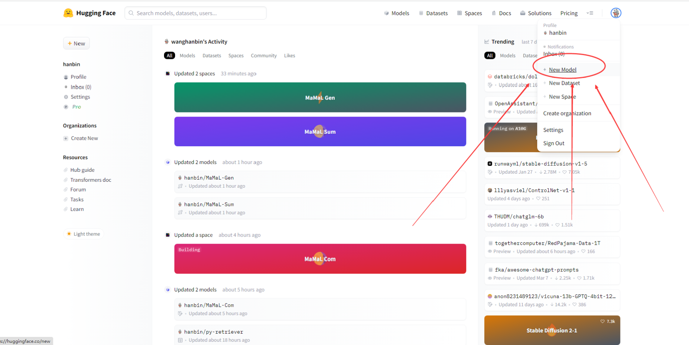
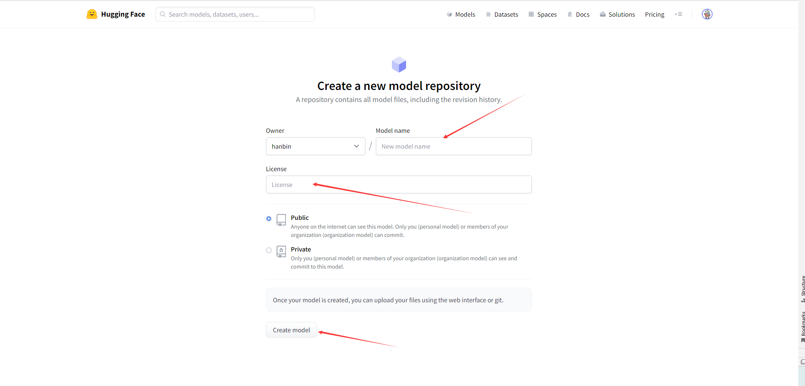
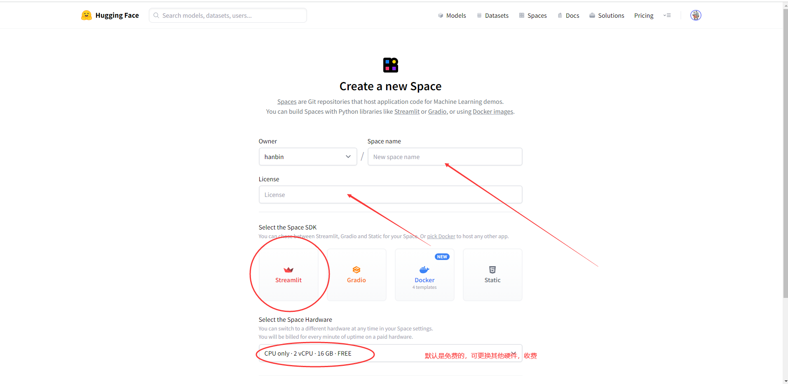
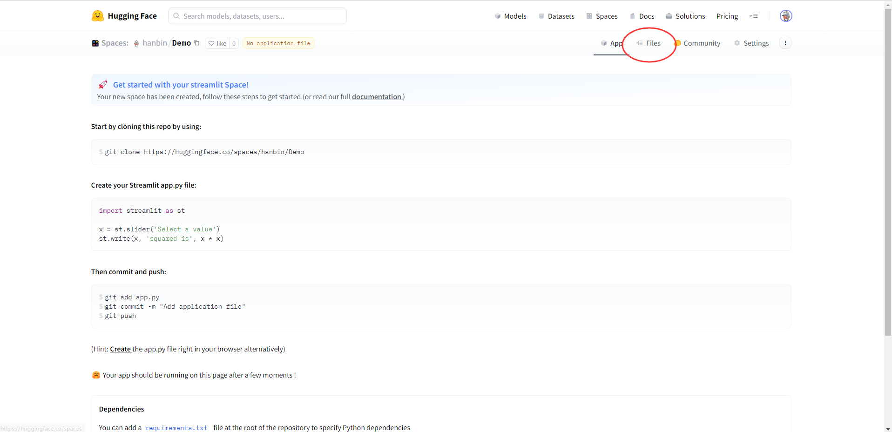
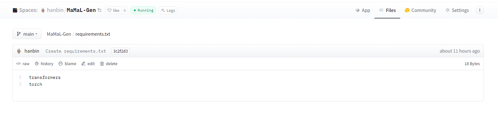

# Building and hosting Streamlit apps in HF Spaces

Streamlit让用户可以自由地用Python以一种交互式的方式构建一个全功能的网络应用。每次应用程序的状态发生变化时，你的代码就会被重新运行。Streamlit也非常适合数据可视化，支持一些图表库，如Bokeh、Plotly和Altair。

使用Hugging Face可以托管我们的模型，并且下面这篇博文介绍了[如何在Spaces中构建和托管Streamlit应用程序](https://huggingface.co/blog/streamlit-spaces)。

在本文档中，我们主要介绍如何将自然语言处理模型托管到Hugging Face，以及如何利用Hugging Face Spaces和Streamlit构建一个可以在线访问的Demo。

### 使用HF托管模型

1.首先进入到HF的主页，并且注册一个账号。

2.注册账号后，点击右上角的头像,然后点击 `New Model`即可进入我们的模型创建界面。 



3.输入模型的名称、是否公开等信息，点击 `Create Model`，即可创建成功。




4.最后一步，将模型文件上传，首先找到模型文件，此时文件夹是**空的**。点击 `Add file`，即可上传文件，选择你喜欢的方式上传文件即可！最后点击commit，即可上传成功，这也意味着模型托管成功！


### 利用托管在HF的模型创建APP

1.首先进入到HF的主页，创建一个space。点击右上角的头像,然后点击 `New pace`即可进入我们的pace创建界面。 


2.编辑Space的基本信息，名称等。Space SDK一定要选择Streamlit。



3.进入创建的Space，点击右上角的`Files`，即可查看当前Space所包含的文件，未来我们的代码，图像等文件都将放在该文件夹中。




4.用Streamlit编写Python脚本，命名为app.py。如下面的代码是我们的示例。

```python
# This file is .....
# Author: Hanbin Wang
# Date: 2023/4/18
import transformers
import streamlit as st
from PIL import Image

from transformers import RobertaTokenizer, T5ForConditionalGeneration
from transformers import pipeline

@st.cache_resource
def get_model(model_path):
    tokenizer = RobertaTokenizer.from_pretrained(model_path)
    model = T5ForConditionalGeneration.from_pretrained(model_path)
    model.eval()
    return tokenizer, model


def main():
    # `st.set_page_config` is used to display the default layout width, the title of the app, and the emoticon in the browser tab.

    st.set_page_config(
        layout="centered", page_title="MaMaL-Gen Demo(代码生成)", page_icon="❄️"
    )

    c1, c2 = st.columns([0.32, 2])

    # The snowflake logo will be displayed in the first column, on the left.

    with c1:
        st.image(
            "./panda23.png",
            width=100,
        )

    # The heading will be on the right.

    with c2:
        st.caption("")
        st.title("MaMaL-Gen(代码生成)")


    ############ SIDEBAR CONTENT ############

    st.sidebar.image("./panda23.png",width=270)

    st.sidebar.markdown("---")

    st.sidebar.write(
    """
    ## 使用方法：
    在【输入】文本框输入自然语言，点击【生成】按钮,即会生成想要的代码。
    """
    )

    st.sidebar.write(
    """
    ## 注意事项：
    1）APP托管在外网上，请确保您可以全局科学上网。
    
    2）您可以下载[MaMaL-Gen](https://huggingface.co/hanbin/MaMaL-Gen)模型，本地测试。（无需科学上网）
    """
    )
    # For elements to be displayed in the sidebar, we need to add the sidebar element in the widget.

    # We create a text input field for users to enter their API key.

    # API_KEY = st.sidebar.text_input(
    #     "Enter your HuggingFace API key",
    #     help="Once you created you HuggingFace account, you can get your free API token in your settings page: https://huggingface.co/settings/tokens",
    #     type="password",
    # )
    #
    # # Adding the HuggingFace API inference URL.
    # API_URL = "https://api-inference.huggingface.co/models/valhalla/distilbart-mnli-12-3"
    #
    # # Now, let's create a Python dictionary to store the API headers.
    # headers = {"Authorization": f"Bearer {API_KEY}"}


    st.sidebar.markdown("---")

    st.write(
        "> **Tip：** 首次运行需要加载模型，可能需要一定的时间！"
    )

    st.write(
        "> **Tip：** 左侧栏给出了一些good case 和 bad case，you can try it！"
    )
    st.write(
        "> **Tip：** 只支持英文输入，输入过长，效果会变差。只支持Python语言"
    )

    st.sidebar.write(
        "> **Good case：**"
    )
    code_good = """1)Convert a SVG string to a QImage
2)Try to seek to given offset"""
    st.sidebar.code(code_good, language='python')

    st.sidebar.write(
        "> **Bad cases：**"
    )
    code_bad = """Read an OpenAPI binary file ."""
    st.sidebar.code(code_bad, language='python')

    # Let's add some info about the app to the sidebar.

    st.sidebar.write(
    """
    App 由 东北大学NLP课小组成员创建， 使用 [Streamlit](https://streamlit.io/)🎈 和 [HuggingFace](https://huggingface.co/inference-api)'s [MaMaL-Gen](https://huggingface.co/hanbin/MaMaL-Gen) 模型.
    """
    )

    # model, tokenizer = load_model("hanbin/MaMaL-Gen")
    st.write("### 输入：")
    input = st.text_area("", height=100)
    button = st.button('生成')

    tokenizer,model = get_model("hanbin/MaMaL-Gen")

    input_ids = tokenizer(input, return_tensors="pt").input_ids
    generated_ids = model.generate(input_ids, max_length=100)
    output = tokenizer.decode(generated_ids[0], skip_special_tokens=True)
    # generator = pipeline('text-generation', model="E:\DenseRetrievalGroup\CodeT5-base")
    # output = generator(input)
    # code = '''def hello():
    #     print("Hello, Streamlit!")'''
    if button:
        st.write("### 输出：")
        st.code(output, language='python')
    else:
        st.write('####         输出位置~~')


if __name__ == '__main__':

    main()
```

> 注意：
>
> ```
> @st.cache_resource
> def get_model(model_path):
>     tokenizer = RobertaTokenizer.from_pretrained(model_path)
>     model = T5ForConditionalGeneration.from_pretrained(model_path)
>     model.eval()
>     return tokenizer, model
> ```
>
> 上面的代码是我们从hugging face上load模型的一段代码，将model_path换成hugging face的路径即可，要加上@st.cache_resource缓存，模型路径和代码不修改时，直接从缓存中加载模型，速度很快。下面是load模型的一个实例：
>
> ```
>  tokenizer,model = get_model("hanbin/MaMaL-Gen")
> ```

5.针对于该脚本所用到的依赖，新建一个`requirements.txt`,如图所示：



当模型加载时，会自动下载这里面的依赖，而不需要我们进行任何其他的操作。

6.进行上述操作后，可以在APP看到我们的Demo啦！


